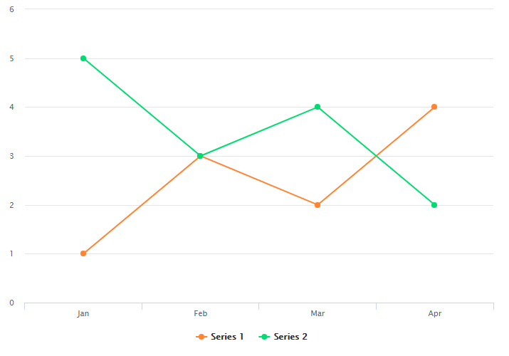

# Integrum Highchart export server

Http сервер для рендера графиков **Highchart.js**, сделан на основе [Puppeteer](https://github.com/GoogleChrome/puppeteer)  
Для запуска требуется **Node.js** версии **8.9.4+**
Может работать на Windows и Linux

### Настройка   
**config.json**
```json
{
    "port":3000,
    "сoncurrent":0,
    "maxQueue":0,
    "template":"http://localhost:3000/placeholder",
    "headless":false
}
```
где:  
`port` - порт, который будет прослушивать запущенный node процесс  
`сoncurrent` - кол-во одновременно работающих табов в Chrome, если указать 0, 
то кол-во табов будет равно колв-ву процессоров.  
`maxQueue` - максимальный размер очереди, который формируется, если запросы на svg с чартами поступают быстрее, 
чем chrome их обрабатывает. Если указать 0, очередь будет бесконечная.  
`template` - адрес с пустым html шаблонов в котором формируется svg. Лучше не менять.  
`headless` - флаг, который позволяет изменять headless режим Chrome. 
Если false, то броузер запускается с интерфейсом, можно посмотреть что он делает.   

На веб сервере нужно настроить доступ к api `http://localhost:3000/svg`, в файле `web.config` пример настройки для IIS

Единственный `api` метод `http://localhost:3000/svg`, принимает `POST` запрос 
c contentType `application/json` в теле которого следует отправлять объект с 
настройками для рендера SVG графика  

###Запуск

Скачать  
```cmd
git clone http://tfs:8080/tfs/Integrum/Frontend/_git/Highcharts-export-server
```
Установить
```cmd
npm i 
```
Запустить 
```cmd
node index
```
Запустить в более боевом режиме можно с помощью [PM2](https://github.com/Unitech/pm2)
```cmd
pm2 start index.js
``` 


### Как пользоваться

Примеры запросов лежат в `json` файлах папки `test`.
Файл test.js содержит тест который можно выполнить в окружении node.js
При тестировании из броузера следует помнить, что броузер не может отправлять одновременно более N запросов.
Файл `postman_collection.json` содержит заготовку с данными для программы Postman.
Например
```javascript
$.ajax('http://localhost:3000/chart', {
            method: 'POST',
            data: JSON.stringify({
                "exportSettings": {
                    "width": 700,
                    "height": 500
                },
                "chartSettings": [{
                    "id": "test",
                    "options": {}
                }]
            }),
            contentType: 'application/json',
            success: function (data) {
                console.log(data)
            }
        });
```

где:   
`exportSettings` - настройки ширины и высоты svg    
`id` - любой объект\текст, который будет возращен назад вместе с svg для идентификации svg.  
`options` - объект с данными для графика `chartType, categories, series`  

например:  
```json
{
    "chartType":"Graph",
    "categories": ["Jan", "Feb", "Mar", "Apr", "Mar", "Jun", "Jul", "Aug", "Sep", "Oct", "Nov", "Dec"],
    "series": [
        {
            "type": "line",
            "data": [1, 3, 2, 4]
        },
        {
            "type": "line",
            "data": [5, 3, 4, 2]
        }
    ]
}
```
Возможные значения `chartType`
- SimpleHorizontalHistogram
- HorizontalStacked
- HorizontalNormalized
- HorizontalHistogram
- PieChart
- Graph
- AreaGraph
- SimpleVerticalHistogram
- VerticalHistogram
- VerticalComboHistogram
- VerticalStacked
- VerticalNormalized

Можно отправлять массив
```javascript
chartSettings: [
   { id, options },
   { id, options },
   { id, options }
]
```

В ответе будет всегда массив svg (в поле data)

```javascript
[
    {id, data }
]
```

На основе данных из примера должен получаться вот такой график




